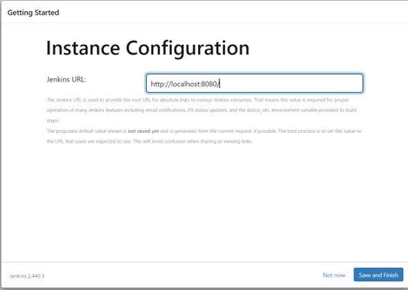
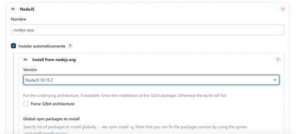

# Configuración de Jenkins con Docker Compose

Este repositorio contiene instrucciones detalladas para configurar Jenkins utilizando Docker Compose. A continuación, se describen los pasos necesarios para asegurar la persistencia de datos, configurar Jenkins y crear un pipeline básico.

## **_Construido con_** 

<div style="text-align: left">
    <p>
        <a href="https://docs.docker.com/" target="_blank"> 
            
        </a>
        <a href="https://www.jenkins.io" target="_blank">
            
        </a>
    </p>
</div>

---

## Paso 1: Definir un Volumen en Docker Compose

En el archivo `docker-compose.yml`, definimos un volumen para almacenar los datos de Jenkins. Esto garantiza que los datos persistan incluso si el contenedor se detiene o se elimina.

**¿Por qué definir un volumen?** Cuando ejecutamos un contenedor Docker, los datos dentro del contenedor son efímeros y se perderán si el contenedor se detiene o se elimina. Al definir un volumen, estamos separando los datos de Jenkins del contenedor, permitiendo que persistan más allá del ciclo de vida del contenedor.

```yaml
services:
  jenkins:
    image: jenkins/jenkins:lts
    ports:
      - "8080:8080"
      - "3000:3000"
    volumes:
      - jenkins_sa:/var/jenkins_home
volumes:
  jenkins_sa:
    name: "jenkins_sa"

```

## Paso 2: Levantar el Contenedor de Jenkins

Para iniciar los servicios definidos en tu archivo `docker-compose.yml`. ejecuta el siguiente comando en tu terminal desde la ubicación donde se encuentra dicho archivo. Esto levantará los contenedores de Docker en segundo plano, permitiendo que Jenkins se ejecute de manera continua sin bloquear la terminal:

```bash
docker-compose up -d
```

<p align="left">
  
</p>


## Paso 3: Verificar la Persistencia de Datos

Para verificar que los datos se están almacenando correctamente en el volumen `jenkins_sa`, utiliza el siguiente comando:

```bash
docker volume inspect jenkins_sa
```

<p align="left">
  
</p>


Este comando proporciona información detallada sobre el volumen, incluida la fecha y hora de creación, el controlador de volumen utilizado, las etiquetas asociadas, la ubicación en el sistema de archivos del host donde se monta el volumen y otras opciones adicionales, si se especifican. Esto te permitirá confirmar que los datos se están almacenando correctamente y comprender dónde y cómo están guardados en el sistema de archivos del host.

## Paso 4: Verificar el ID del Contenedor

```bash
docker ps -a
```

<p align="left">
  
</p>


## Paso 5: Ver los registros del Contenedor

Dado que el contenedor está en ejecución, deberías poder ver los registros del contenedor utilizando el siguiente comando:

```bash
docker logs <ID_del_Contenedor>
```

Sustituye `<ID_del_Contenedor>` con el ID específico del contenedor de Jenkins. Estos registros proporcionan información sobre el inicio y la configuración inicial del servidor Jenkins en el contenedor. La contraseña generada automáticamente es importante ya que se necesitará para completar la configuración inicial de Jenkins a través de la interfaz web, al final de los logs puedes ver la contraseña.

<p align="left">
  
</p>


## Paso 6: Obtener la Contraseña de Administrador

Otra forma de obtener la contraseña generada automáticamente para la configuración inicial de Jenkins es desde dentro del contenedor. Puedes utilizar el comando `docker exec` seguido del ID del contenedor y el comando `cat` para leer el contenido del archivo que contiene la contraseña. Aquí está el comando completo:

```bash
docker exec <ID_del_Contenedor> cat /var/jenkins_home/secrets/initialAdminPassword
```

<p align="left">
  
</p>

## Paso 7: Acceder a Jenkins

Una vez que Jenkins esté en funcionamiento, accede a él desde tu navegador web usando `localhost:8080`. Utiliza la contraseña de administrador obtenida en el paso anterior para completar la configuración inicial.

<p align="left">
  
</p>


## Paso 8: Configurar Jenkins

Selecciona `Select plugins to install`, para buscar el plugins de node que se requiere

<p align="left">
  
</p>

Se debe configurar el usuario `admin`:

<p align="left">
  
</p>

Se confirua la `Url` de jenkins

<p align="left">
  
</p>


## Paso 9: Instalar Plugins

En Jenkins, En el apartado de `Tools` configuramos la versión de node que necesitamos, en este caso es la `10.15.2`

<p align="left">
  
</p>

<p align="left">
  
</p>


## Paso 10: Configurar Herramientas

### Creación del primer pipeline
  - En el panel de administración seleccionamos `Nueva tarea` para la creación del pipeline.
  -	Asignamos un `nombre` a nuestra tarea
  -	Elegimos `Crear proyecto de estilo libre`

<p align="left">
  
</p>

### Haremos la configuración
  -	Damos la `Url` del repositorio de nuestro proyecto y seleccionamos la rama en mi caso la `main`

<p align="left">
  
</p>

  -	Seleccionamos el `Entorno de ejecución`.        

<p align="left">
  
</p>

  -	Seleccionamos en `Build` steps `Ejecutar en línea de comandos shell`

<p align="left">
  
</p>

  -	Pasamos estos comandos :

```bash
npm install
npm run build
node app.js
```
<p align="left">
  
</p>

  -	Le daremos en guardar.

<p align="left">
  
</p>


## Paso 11: Crear un Pipeline

  -	Ejecutaremos el pipeline, luego iremos a `Console Ouput`, para ver la dirección del servidor que esta corriendo.

<p align="left">
  
</p>

  -	Por ultimo veremos la respuesta del servidor :

<p align="left">
  
</p>


## Jenkins Lab

### Ejecutar Docker Compose

Para ejecutar Docker Compose, asegúrate de que tengas Docker Compose instalado en tu sistema. Luego, sigue estos pasos:

1. Navega a la ubicación donde se encuentra tu archivo `docker-compose.yml`.

2. Ejecuta el siguiente comando en tu terminal para iniciar los contenedores definidos en el archivo `docker-compose.yml`:

```bash
docker-compose up -d
```

### Extraer Contraseña de Administrador

Para obtener la contraseña generada automáticamente para la configuración inicial de Jenkins, primero necesitas el ID del contenedor. Puedes obtenerlo con el siguiente comando:

```bash
docker ps -a
```

Una vez que tengas el ID del contenedor, utiliza el siguiente comando para extraer la contraseña:

```bash
docker exec <ID_del_Contenedor> cat /var/jenkins_home/secrets/initialAdminPassword
```

¡Listo! Ahora tienes Jenkins configurado con Docker Compose y un pipeline básico listo para ejecutar tu proyecto.


---

## **_Autor_** 

<div style="text-align: left">
    <a href="https://github.com/G20-00" target="_blank"> </a>
</div>
